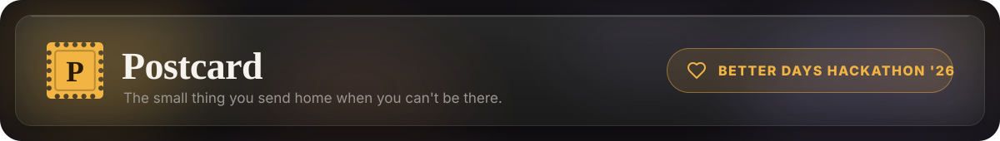
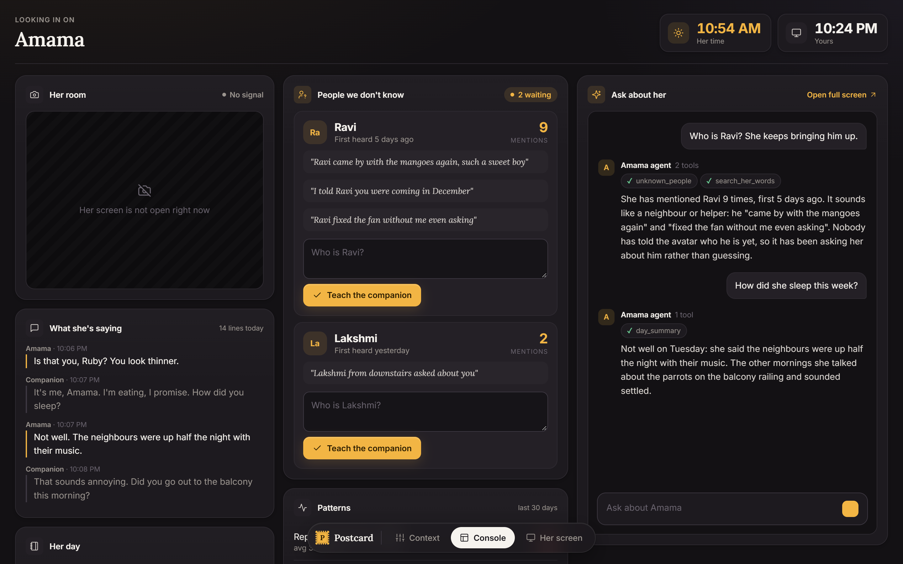
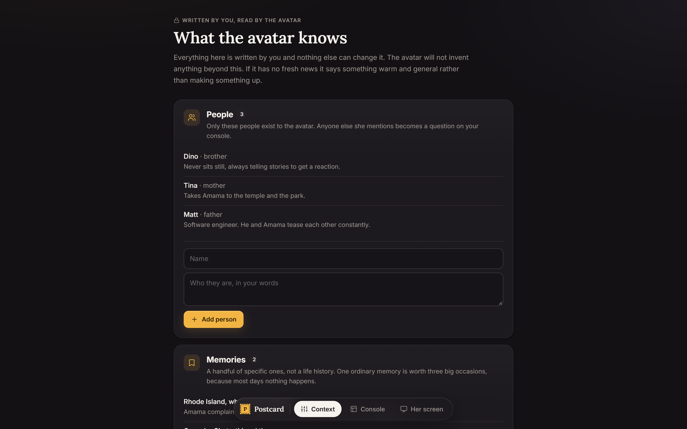
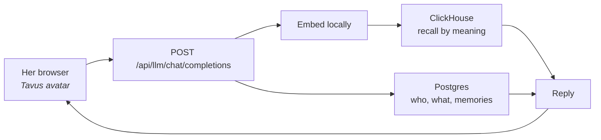
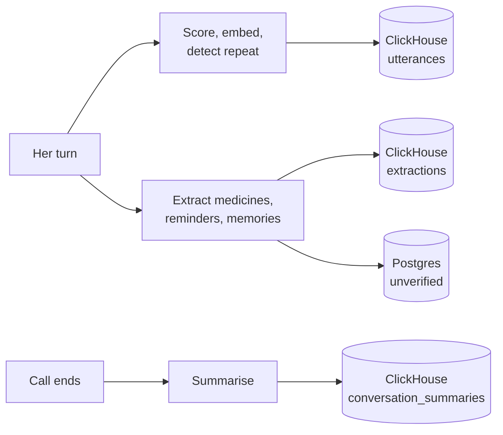
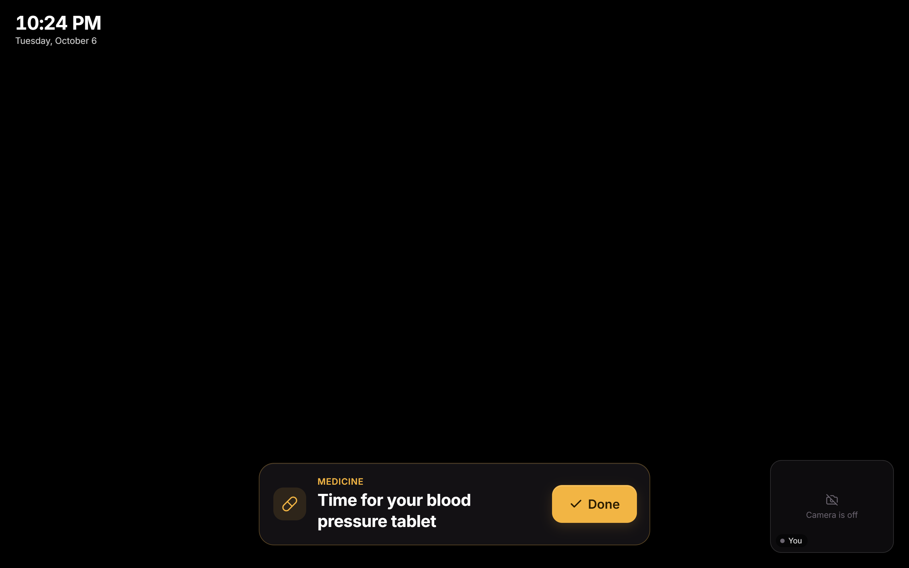

<p align="center">
  
</p>

**The small thing you send home when you can't be there.**

A granddaughter moved from Chennai to the US. Her grandmother is seventy, alone
most days, and eleven and a half hours behind. They talk about once a week.

Postcard is what fills the other six days: an avatar of the granddaughter that her
grandmother can talk to whenever she wants, and a console on the other side of
the world that tells the granddaughter what she missed.

It remembers everything her grandmother says. It knows only what the
granddaughter has told it about herself.

**Built for ClickHouse's Better Days Hackathon 2026.**



[Where each service is used](docs/where-each-service-is-used.md) · [The persona](docs/persona.md) · [Running it locally](docs/RUNNING.md) · [Hosted demo](docs/DEPLOY.md)

## What it does

| Where | What happens | Why it matters |
| --- | --- | --- |
| **Her screen** | A full-screen Tavus avatar of Ruby she can talk to any time, with the clock, her own camera, and medicine reminders she taps **Done** on | Company on the six days there is no call |
| **Console** | Ruby sees her room, what she said today, medicine answers, and the day written up, on both clocks | The week she missed, in one place |
| **People we don't know** | Names the avatar heard but nobody explained, with mention counts and quotes. Type who they are and the avatar knows next time | The avatar asks instead of guessing |
| **Patterns** | Repeated questions against her own average, medicine adherence, and when in the day she sounds unsettled | Slow changes show up before anyone has to say them |
| **Ask about her** | A LibreChat agent with MCP tools over ClickHouse and Postgres | Ask "how did she sleep this week?" and get an answer from her own words |
| **Context** | The curated facts the avatar is allowed to say: people, memories, medicines, news | "Never invent anything" is enforced by the data, not the prompt |



---

## The idea in one paragraph

Companion products usually fail in one of two ways. Either they invent things to
keep the conversation going, which is corrosive when the person on the other end
trusts them, or they forget everything past the last few messages, which makes
them useless for the one job a companion has.

Postcard fixes both by splitting memory in two. What the avatar knows about the
granddaughter lives in **Postgres**: a handful of relationships, five memories,
whatever news she has written down this week. Small, curated, and the only place
a new fact about Ruby can come from, which is what makes "never invent anything"
enforceable rather than aspirational. What the avatar knows about the grandmother
lives in **ClickHouse**: every sentence she has ever said, retrievable by
meaning, plus everything the pipeline derives from those sentences.

When she mentions a name nobody has explained, the avatar stays warm and curious
rather than guessing, and the name goes into a queue. When she mentions a new
tablet, a doctor's appointment, or something worth remembering, the pipeline
pulls it out, logs it in ClickHouse, and writes it into the curated store marked
*unverified* until Ruby confirms it. The system gets better at being family
without anyone doing data entry.

---

## The four services, and where each is used

Full map in [`docs/where-each-service-is-used.md`](docs/where-each-service-is-used.md).

| Service | Role | What lives there |
| --- | --- | --- |
| **Tavus** | The avatar she talks to | Configured to call our `/api/llm/chat/completions` as its model, so retrieval happens *inside* the conversation |
| **ClickHouse** | The conversation side | `utterances` (every turn + embedding), `conversation_summaries`, `extractions` (the audit log of every fact pulled from a chat), and three materialized views. Append-only, grows forever |
| **Postgres** | The curated store the avatar speaks from | People, memories, medicines, reminders, news. Rows are either `source='ruby'` (typed on `/setup`) or `source='conversation'` (auto-extracted, `unverified=true`) |
| **LibreChat** | The "Ask about her" chat in the console's right column | Talks to an MCP server that queries ClickHouse and Postgres directly |

### Every turn



### Off the response path





---

## Running it

```bash
npm install
cp .env.example .env               # set DATABASE_URL + one LLM key
cp librechat.env.example librechat.env

docker compose up -d               # ClickHouse (:8123) + LibreChat (:3080) + Mongo
npm run schema                     # applies schema.sql + clickhouse/schema.sql

npm run server                     # :3001  (first start downloads ~90MB of embedding weights)
npm run seed:context               # loads the Amama / Ruby cast into Postgres
npm start                          # :3000
```

Then:

- `/setup`: the curated context. People, memories, medicines, news.
- `/console`: Ruby's side.
- `/her`: the avatar, on her device.

Embeddings run in-process, no API key. ClickHouse runs in the compose (or point
`CLICKHOUSE_URL` at ClickHouse Cloud). Postgres is any hosted instance, or
`docker compose --profile local-pg up -d`. The only true external dependencies
are one LLM endpoint and Tavus.

Judges can watch ClickHouse fill up at **http://localhost:8123/play**
(`default` / `postcard`).

### Looking at the frontend without any of that

```bash
npm run mock                       # :3001, every endpoint returns plausible data
npm start
```

### Tavus

Configure on the persona:

1. **Model endpoint** → `https://<your-tunnel>/api/llm/chat/completions`
   (`ngrok http 3001` in dev).
2. **Callback URL** → `https://<your-tunnel>/api/tavus/webhook`, also in
   `TAVUS_CALLBACK_URL`.

Without the first, the avatar has no memory and the whole premise is gone.

### Seed conversation history

```bash
npm run seed -- --days 90
```

Generates months of plausible conversation so the console's aggregate panels
have shape (repetition climbing, a name appearing near the end). Needs the LLM
key; embeds locally. Run it the night before, not during.

### LibreChat

`docker compose up -d` starts it. One time, in the LibreChat UI: create an agent
named "Amama", enable the nine `postcard` tools, paste the instructions from
`librechat.yaml`. It reaches the MCP server at
`http://host.docker.internal:3001/mcp`, so `npm run server` must be running.

---

## The persona

`docs/persona.md` is loaded into the system prompt on every turn. Edit it,
restart the server, and the avatar's behaviour changes. No code in it.

- Never invent a fact about Ruby's life. With no fresh news, warm generalities.
- Never tell her she's repeating herself. The console counts repeats silently.
- Never bring up her late husband. If she does, warmly; if she's confused, gently
  and flag it for a human.
- No medical advice beyond asking whether she took what she was prescribed.
- No promises about visits or calls.
- She knows Ruby set the avatar up. The deflection line is true: the avatar
  really does ask Ruby, and the answer comes back the next day.

---

## Demo, in order

1. `/her` on a phone, `/console` on a laptop, ClickHouse console on a third screen.
2. She mentions a place from months ago; the avatar answers with a detail from
   the seeded history. Show the retrieved `utterances` rows.
3. She says "the doctor started me on vitamin D." Show the new row land in
   ClickHouse `extractions` **and** in Postgres `medicines` as unverified. Ask
   the LibreChat agent `facts_to_confirm`; say "yes confirm it".
4. She mentions Ravi. The console shows Ravi with N mentions. Type who Ravi is.
   She mentions him again and the avatar knows.
5. A medicine reminder fires; the avatar says it out loud; the console flips to
   confirmed when she answers.
6. The patterns panel: repeated questions today against her own average.

Steps 3 and 4 are the ones to spend time on: the parts that can't be built with
a prompt.

---

## What this is not

Not a medical device, not a monitoring system, not a substitute for the weekly
call. No location tracking, no motion detection.
